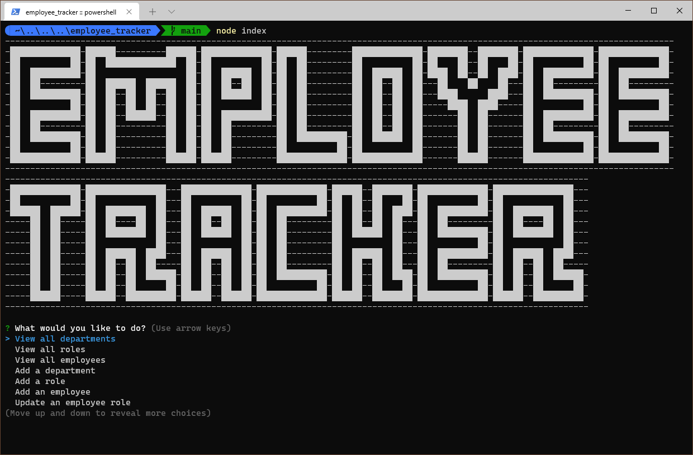
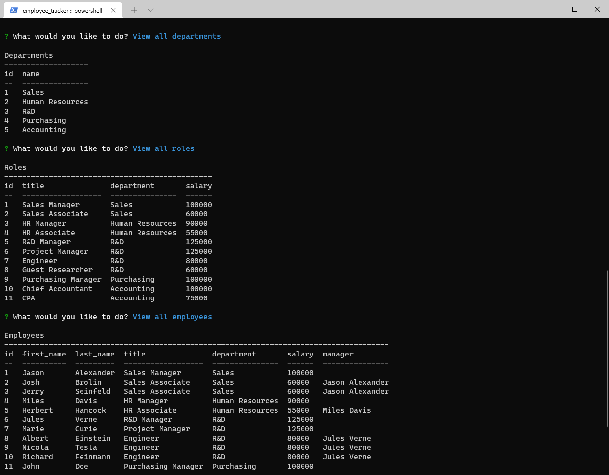
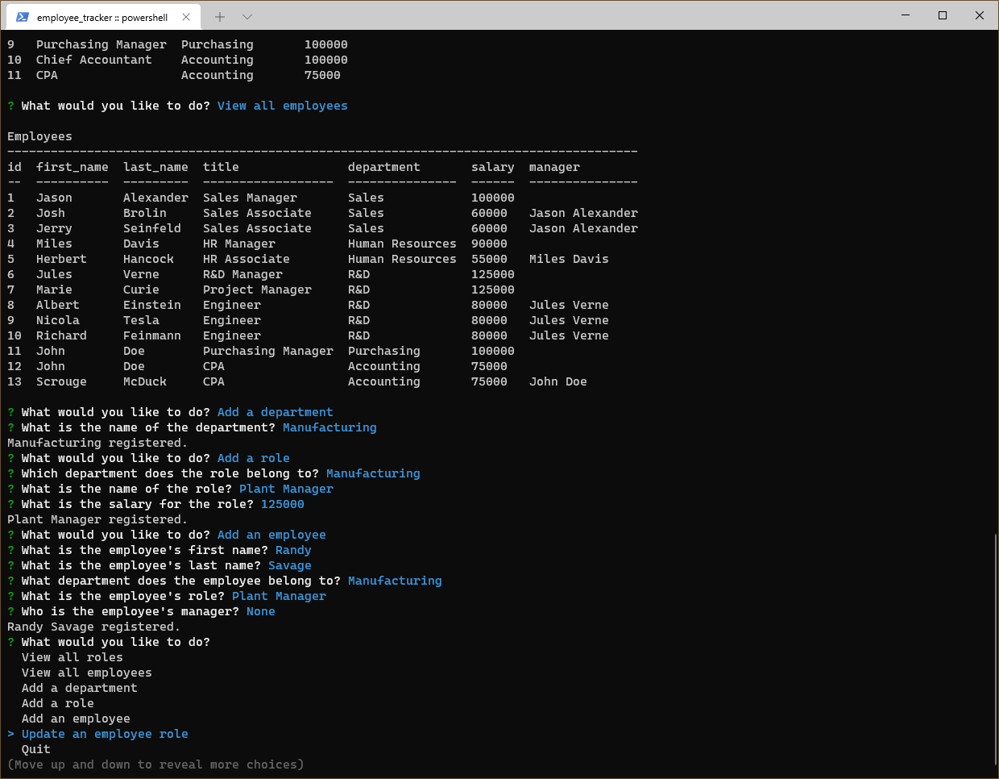

# Employee Tracker [](https://opensource.org/licenses/MIT)

## Description

A simple database app running on Node & MySQL to keep track of employees

## Contents

- [Installation](#installation)
- [Usage](#usage)
- [Questions](#questions)
- [License](#license)

## Installation

You must have Node and MySQL installed to use this program.

At the command line terminal of your choice type the following:

```
git clone https://github.com/baker-ling/employee_tracker
cd employee_tracker
npm install
```

Next, you need to create a file named '.env' in that directory with the following information to create connections to MySQL.

```
DB_NAME=employee_db
DB_USER=[your mysql username]
DB_PASSWORD=[your mysql password]
```

Finally, you need to create the database that this program uses. You can do that either by running `sql/schema.sql` in the MySQL CLI or the MySQL Workbench or by running `node dbinit`. If you use `node dbinit`, the credentials in `.env` must have permissions to create a database.

## Usage

To run the program, type `node index`  at the terminal where you installed this program.

The program runs in the terminal. You will be greeted with an ASCII art banner and a menu asking you what action you would like to take.



Most of the actions are self-explanatory. Here are a few notes of things to be careful of:

- Names (departments, roles, employee first names and last names) are capped at 30 characters.
- The option to quit is at the bottom of the main prompt for actions.





### Walkthrough

A video walkthrough is available [here](https://1drv.ms/v/s!Amp9wAf74eY0mn38pha0NFqHeWoG?e=gXotme).


## Questions

If you have any questions, feel free to reach out via one of the following:

- Email: [brian.baker.bdb@gmail.com](mailto:brian.baker.bdb@gmail.com)
- Github: [@baker-ling](https://github.com/baker-ling/)

## License

This application is distributed under the terms of [MIT License](./LICENSE).
